# Repo Curator

Repo Curator is a guided, human-in-the-loop CLI for preparing existing software
repositories for GitHub portfolio publication. It helps inspect older projects,
propose focused cleanup, preserve authorship and academic context, validate
changes, and publish only after explicit final approval.

It is designed for coursework and other repositories where honest presentation
matters more than turning historical work into polished production software.

## How it works

```mermaid
flowchart LR
    scan[Scan locally<br/>read-only] --> triage[Structured triage<br/>TypeSafe / Jev]
    triage --> human[Human classification<br/>and facts]
    human --> route[Deterministic route]
    route --> inspect[Codex inspection<br/>read-only]
    inspect --> plan[Human plan and R2<br/>approval]
    plan --> edit[Same Codex context<br/>approved edits]
    edit --> review[Human edit review]
    review --> validate[Deterministic validation]
    validate --> final[Human GitHub review]
    final --> publish[Commit and non-force push]

    inspect -. missing fact .-> human
    plan -. revise .-> inspect
    review -. revise .-> edit
    validate -. blocked issue .-> review
```



The workflow deliberately separates evidence collection, model judgment,
generative editing, deterministic checks, and human authority. The normal entry
point is one command:

```sh
uv run --frozen repo-curator run /path/to/repository
```

It starts a new run or resumes the latest unfinished run for that directory. Run
state is stored outside the target repository by default at
`~/.repo-curator/runs/`.

## Requirements

- Python 3.11 or newer
- [`uv`](https://docs.astral.sh/uv/)
- A `TYPESAFE_API_KEY` for guided triage
- The local Codex CLI, authenticated with `codex login`, for inspection and
  approved edits
- Git for Git-backed repositories or approved initial Git setup
- The [GitHub CLI](https://cli.github.com/) authenticated with `gh auth login`
  only when you choose to publish

The scanner works offline and does not need API credentials. Triage is an
external, paid TypeSafe request. A guided run may require several human answers
and approvals; it does not run unattended.

## Install and first run

From a checkout of this repository:

```sh
uv sync --dev
uv run --frozen repo-curator --help
```

Try the reproducible offline scanner demo first:

```sh
uv run --frozen repo-curator scan examples/synthetic-coursework
```

For a real guided curation run, keep credentials in your shell rather than in a
repository file:

```sh
export TYPESAFE_API_KEY='your-key-here'
codex login
uv run --frozen repo-curator run /path/to/repository
```

The command scans, collects your A/B/C portfolio classification, performs
read-only inspection, asks for approval before meaningful changes, resumes the
same worker context for approved edits, validates, and presents a final
publication review. It can work with a plain local folder: Git initialization,
the initial commit, GitHub repository creation, and push are all shown and
require that final approval.

To publish after a run reaches final review, authenticate GitHub first:

```sh
gh auth login
```

See the [demo guide](docs/DEMO.md) for the captured offline run and the full
prerequisite boundary. See [CLI UX](docs/CLI_UX.md) for the interaction model.

## Engineering choices

- **One persistent worker context:** inspection, approved editing, and later
  diagnosis reuse repository understanding instead of repeatedly rebuilding it.
- **Explicit authority:** the worker can propose changes; the human supplies
  personal facts and approves meaningful deletions, restructuring, edits, and
  publication.
- **Deterministic controls around models:** routing, state transitions,
  validation, Git/GitHub safeguards, and report schemas are ordinary Python and
  independently tested.
- **Privacy-conscious triage and evaluation:** triage receives a bounded,
  redacted repository summary. Evaluation exports omit source content, paths,
  credentials, remote identities, and worker conversation history.

More detail is in the [architecture](docs/ARCHITECTURE.md),
[workflow](docs/WORKFLOW.md), and [requirements](docs/REQUIREMENTS.md).

## Evaluation and development dogfooding

Repo Curator was developed through iterative testing on real university
coursework repositories. Observed failures informed changes to its prompts and
workflow. This dogfooding is a development methodology, not an independent
evaluation.

A separate evaluation set is being developed to assess behavior on previously
unseen repositories. The public repository includes an [anonymous case template
and evaluation instructions](evaluations/README.md) plus an [evaluation
methodology](docs/EVALUATION.md). It does not yet publish independent evaluation
results or make aggregate quality or reliability claims.

## Limitations and safety boundaries

- Repo Curator does not guarantee that a repository is correct, secure, or ready
  for publication. Review every plan, diff, validation concern, and final GitHub
  target yourself.
- It never invents authorship, academic context, licensing, or results. Missing
  evidence becomes a human question or an unresolved concern.
- It does not automatically publish to forks, organization-owned repositories,
  or foreign-owned remotes, and it never force-pushes or rewrites history.
- Validation is intentionally bounded and proportional. It may not execute every
  project, install dependencies, or prove behavior beyond available evidence.
- Current evaluation exports retain limited per-attempt telemetry and no provider
  billing cost. They cannot independently establish preservation of student work.
- This repository has no license file. Do not assume permission to reuse it until
  its maintainer chooses one.

## Documentation

- [Architecture](docs/ARCHITECTURE.md)
- [Workflow and state model](docs/WORKFLOW.md)
- [Product requirements](docs/REQUIREMENTS.md)
- [CLI user experience](docs/CLI_UX.md)
- [Demo guide](docs/DEMO.md)
- [Evaluation methodology](docs/EVALUATION.md)
- [Evaluation instructions and anonymous case template](evaluations/README.md)

## Development

```sh
uv sync --dev
uv run --frozen pytest -q
```

The test suite uses fake providers and command runners; it does not spend
TypeSafe or Codex allowance or modify real GitHub repositories.
